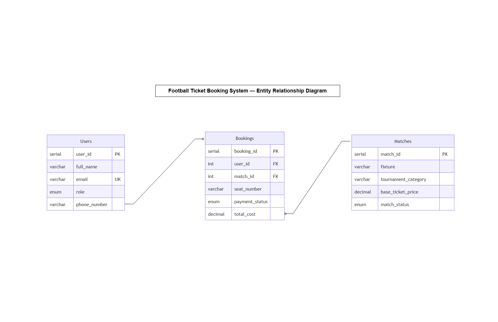

# Football Ticket Booking System

A PostgreSQL database assignment implementing a simplified football ticket booking system with ERD design, schema creation, sample data, and SQL queries.

## Links

- **ERD (Interactive Viewer):** [View ERD on diagrams.net](https://viewer.diagrams.net/?tags=%7B%7D&lightbox=1&target=blank&highlight=0000ff&edit=_blank&layers=1&nav=1&title=Assignment_three_ERD.drawio&dark=auto#Uhttps%3A%2F%2Fdrive.google.com%2Fuc%3Fid%3D1QT8u3DBzweWTXtJah9I6oWYAqX-kCH8i%26export%3Ddownload)
- **ERD (Google Drive):** [View ERD on Google Drive](https://drive.google.com/file/d/1QT8u3DBzweWTXtJah9I6oWYAqX-kCH8i/view?usp=drive_link)
- **GitHub Repository:** [Sakebul-islam/Assignment-3](https://github.com/Sakebul-islam/Assignment-3)
- **Interview Video:** [Watch on Google Drive](https://drive.google.com/file/d/1qnsB5XDFcOP6VUPFzPv5VZKpJDzSKM1_/view?usp=sharing)

## ERD Diagram



## Database Schema

Three tables form the core of the system:

**Users** — Stores registered fans and ticket managers.
**Matches** — Catalogs football events and their ticket availability.
**Bookings** — Transactional table linking users to their purchased match tickets.

### Relationships

- One **User** → Many **Bookings** (a fan can book tickets for multiple matches)
- Many **Bookings** → One **Match** (a match can have thousands of bookings)
- Each **Booking** row maps exactly one user to one match (logical 1-to-1 per seat)

## Project Structure

```
Assignment-3/
├── ERD/
│   ├── Assignment_three_ERD.drawio
│   └── Assignment_three_ERD.png
├── table_create_and_data_insertation.sql
├── QUERY.sql
└── README.md
```

## How to Run

### Prerequisites

- PostgreSQL installed and running

### Steps

1. Create the database and tables, then seed sample data:

```sql
psql -U postgres -f table_create_and_data_insertation.sql
```

2. Run the queries:

```sql
psql -U postgres -d assignment_three -f QUERY.sql
```

## Sample Data

### Users

| user_id | full_name | email | role | phone_number |
|---|---|---|---|---|
| 1 | Tanvir Rahman | tanvir@mail.com | Football Fan | +8801711111111 |
| 2 | Asif Haque | asif@mail.com | Football Fan | +8801722222222 |
| 3 | Sajjad Rahman | sajjad@mail.com | Ticket Manager | +8801733333333 |
| 4 | Jannat Ara | jannat@mail.com | Football Fan | NULL |

### Matches

| match_id | fixture | tournament_category | base_ticket_price | match_status |
|---|---|---|---|---|
| 101 | Real Madrid vs Barcelona | Champions League | 150.00 | Available |
| 102 | Man City vs Liverpool | Premier League | 120.00 | Selling Fast |
| 103 | Bayern Munich vs PSG | Champions League | 130.00 | Available |
| 104 | AC Milan vs Inter Milan | Serie A | 90.00 | Sold Out |
| 105 | Juventus vs Roma | Serie A | 80.00 | Available |

### Bookings

| booking_id | user_id | match_id | seat_number | payment_status | total_cost |
|---|---|---|---|---|---|
| 501 | 1 | 101 | A-12 | Confirmed | 150.00 |
| 502 | 1 | 102 | B-04 | Confirmed | 120.00 |
| 503 | 2 | 101 | A-13 | Confirmed | 150.00 |
| 504 | 2 | 101 | NULL | NULL | 150.00 |
| 505 | 3 | 102 | C-20 | Pending | 120.00 |

## Queries Covered

| # | Description | Concepts Used |
|---|---|---|
| 1 | Champions League matches with `Available` status | `WHERE`, filtering |
| 2 | Users named `Tanvir` or containing `Haque` | `ILIKE`, pattern matching |
| 3 | Bookings with missing payment status | `IS NULL`, `COALESCE` |
| 4 | Booking details with user name and match fixture | `INNER JOIN` |
| 5 | All users with bookings, including fans with none | `LEFT JOIN` |
| 6 | Bookings above the average total cost | Subquery, `AVG` |
| 7 | Top 2 most expensive matches, skipping the highest | `ORDER BY`, `LIMIT`, `OFFSET` |
